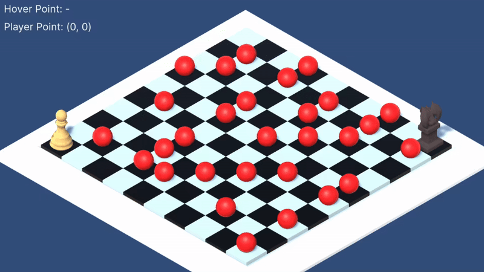

# unity-grid-assignment

### Notes:  
1. You can see my progress with each assignment in the commits
2. As specified in Assignment 4:
   > _This should be done following proper OOP concepts. The ‘Enemy AI’ script is expected to inherit from an ‘AI’ interface._

   I'm not quite sure why OOP was requested as I feel ECS would have been more ideal & I don't see any usage for 'AI' interface here but I've complied with all the instructions regardless